# CSS Administration System

## Sections
The system is divided into the following sections from the admin to the frontend:

- [Accounts and Permissions Management For Executives](#accounts-and-permissions-management)
- [Academics and Resources](#academics-and-resources)
- [Exam Allocation System](#exam-allocation-system)
- [Exam Message Scheduling](#exam-message-scheduling)
- [Exam Map Direction](#exam-map-scheduling)
- [Events and News/Blogs](#events-and-news)
- [Student Specific Sms Notification](#)
- [Internships](#)
- [Report/Contact Us Contol Service](#)
- [Timeline and Executive Position History](#timeline-and-executive-position-history-achievements)
- [Student Dashboard](#user-dashboard)
- [Academic Resources Saving In Account](#)
- [Blog Saving](#)
- [Advertisements](#advertisements)
- [Products and Merchandise Purchase](#products-and-merchandise)
- [And More](#and-more)

---

### Frontend Hosted On [Here](http://css.bookmie.com)
### Frontend CodeBase [Here](https://github.com/Bookmie-Devs/CSS-KNUST-Frontend)
### Database ERD Design [Here](#erd)
### Backend Api Docs [Here](https://cssknust.pythonanywhere.com/api-docs/)
### Backend FilsSystem [Here]()

---

## Overview

The CSS Administration System is a platform designed to manage the various roles and responsibilities within the CSS Department. It is organized into sections corresponding to different levels of access, ensuring proper permissions are granted to each role. The system allows the President, or the Admin (acting as a proxy when the President is unavailable), to manage these permissions and all aspects of the system effectively.

## Executives Admin Control System
(Controls the site from news, blogs, events to educational resources which are regulated by the right executive in charge)
(An Executive assign to a Group only views, edit or create entities the group has permissions base on rules set by the system admin(President or Proxy); more about this in the permissions section)

## Department Site

---

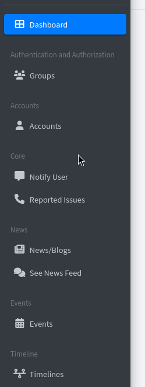

---

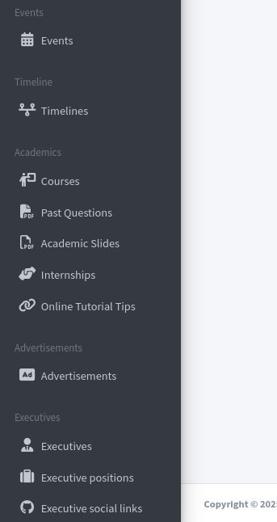

---

---
- Please Note: The Backend Sytem Admin(President) controls permissions and resources the frontend⬇️  has access to 

## Accounts and Permissions Management

Every CSS Executive or appointee is provided with an Administrator account by the elected President or Proxy Administrator. During account creation, permissions are set according to the user's role. The account details, such as index number, phone number, and a custom password, are provided, and the user can change their password later.

- The executive dashboard is only available to authorized executives and can be accessed during the login process on the department site as an option to login into executive dashboard.
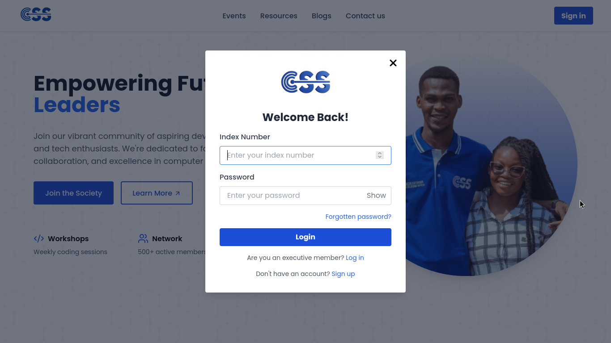
---
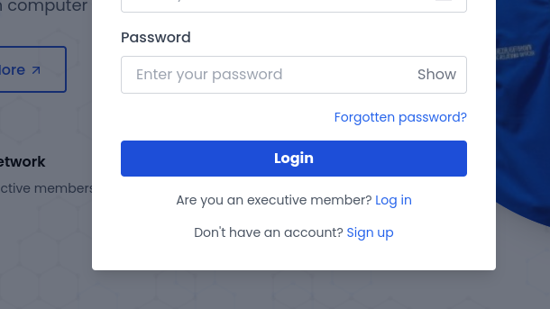
---
- Note That: The login page to the excutive dashboard can only seen after the system takes in your index number and verify that you are an active staff memeber after which you will be redirected to the login page of the executive dashboard(this is called the excutive door(this is called the excutive door).
- Also Note: Student login to get access to thier saved blogs, saved past questions, saved slides and examination allocation map is different fromt the excutive dashboard login. Therefore sessions an token authentication for both is not the same

#### Reccomended view for excutive dashboard
- Due to the complex structring and different components available on the excutive dashboard, It is highly Reccomended to access the dashboard on a laptop to get the full view of all components.
- Note That: This does not apply to the Derpartment site/front-end since it is highly responsive on all devices.

### **Account Activation For Executives:**

- Executives without account on the system are required to signup as regular students on the fronted and later request to have excutive access to the admin system. By then their is already in the system and all the Presidents administor has to do is make them staff and assign the required permissions to them, allowing them to log into the admin and start working right away.

### **Account Misuse:**

- If an account or position is misused, the President can deactivate the account (not delete it). The account can be reactivated after careful consideration.

---

### Managing Executive Groups and Permissions

In the CSS System, **Executive Groups** and **Permissions** are used to control the level of access different users have within the system. This section explains how to manage these groups and permissions for the members of your society.

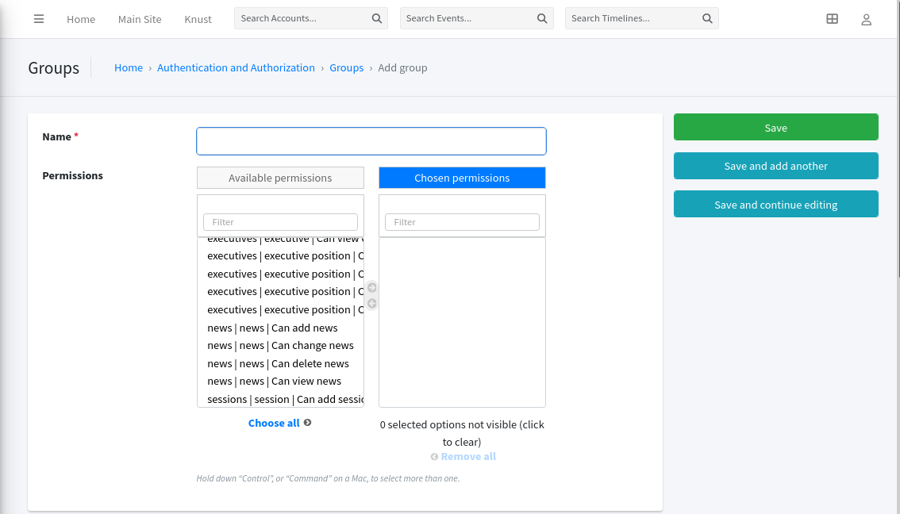

#### Understanding Executive Groups

**Executive Groups** are used to categorize users based on their roles. Each group has different levels of access (permissions), which are inherited by the users in that group.

Common groups may include:

- **Executive Board**: Full control over the system, including managing users and content.
- **General Members**: Can view and create content but cannot delete or modify existing content.
- **Visitors**: Can only view content, with no interaction or modification rights.

#### Managing Executive Groups

To create or manage **Executive Groups**:

1. Navigate to the **Groups** section of the CSS System.
2. You will see a list of existing groups (e.g., **Executive Board**, **General Members**, **Visitors**).
3. To **create a new group**:
   - Click on the **Add Group** button.
   - Enter a name for the new group (e.g., "Event Coordinators").
   - Click **Save** to create the group.
4. To **edit an existing group**:
   - Click on the group name.
   - Add or remove users as needed.
   - Modify the **permissions** associated with the group (explained below).
   - Click **Save** to confirm changes.

#### Managing Permissions for Executive Groups

Permissions define the actions that users within a group can perform. These actions may include:

- **View content**: The ability to see specific pages or data.
- **Add content**: The ability to create new content or records.
- **Edit content**: Modify existing content or settings.
- **Delete content**: Remove data or content.

#### Assigning Permissions to Groups

To assign or modify permissions for a group:

1. In the **Groups** section, click on the desired group.
2. You will see a section called **Permissions**.
3. Use the checkboxes to assign permissions like "Can view content," "Can add content," etc.
4. Click **Save** to apply the changes.

To remove a permission, simply uncheck the relevant box and save the changes.

#### Assigning Users to Executive Groups

After creating or editing an **Executive Group** and its permissions, you can assign users to that group:

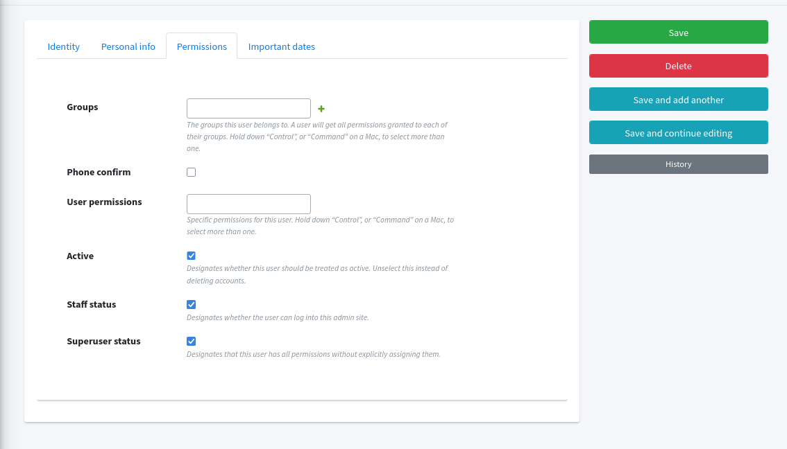

1. Go to the **Users** section in the CSS System.
2. Select the user you want to modify.
3. In the **Groups** section of the user's profile, select the appropriate group (e.g., **Executive Board**, **General Members**, **Visitors**).
4. Click **Save** to apply the changes.

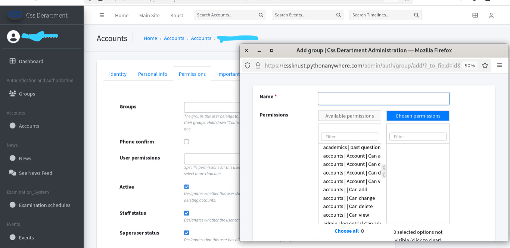

#### Users can also be assign personal Permissions for specific entities without adding them to a groups

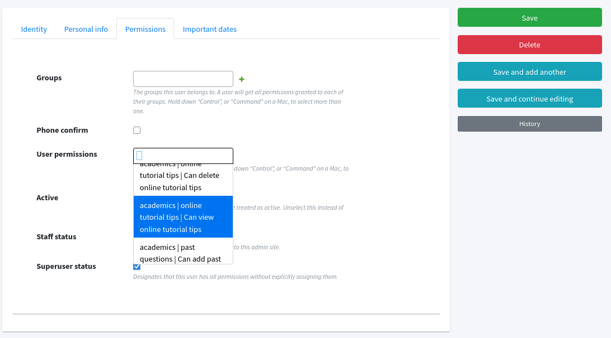

#### Best Practices for Managing Executive Groups and Permissions;

- **Keep it simple**: Use clear and straightforward group names (e.g., **Executive Board**, **Members**, **Visitors**).
- **Limit high-level permissions**: Only assign **Add**, **Edit**, and **Delete** permissions to users who require those capabilities. Most users should only need **View** or **Add** permissions.
- **Review groups regularly**: Periodically check and update groups and their permissions to reflect changes in roles or responsibilities.

#### Example Group and Permission Setup

Here’s a common setup for **Executive Groups** and permissions:

- **Executive Board**:
  - Permissions: **Add**, **Edit**, **Delete**, **View**
  - Users: Admins or key executives who manage content, users, and system settings.

- **General Members**:
  - Permissions: **Add**, **View**
  - Users: Members who can contribute content (e.g., articles) but cannot delete or modify others' content.

- **Visitors**:
  - Permissions: **View** only
  - Users: Guests who can browse the content but cannot interact with it.

#### Summary

- **Executive Groups** organize users by role and determine the actions they can perform.
- **Permissions** define the scope of each group’s actions (view, add, edit, delete).
- You can manage groups and permissions easily through the **Groups** and **Users** sections of the CSS System.
- Regularly review your groups and permissions to ensure users have the appropriate level of access.

Every CSS Executive or appointee is provided with an Administrator account by the elected President. During account creation, permissions are set according to the user's role. The account details, such as email, phone number, and a custom password, are provided, and the user can change their password later.

### **Account Activation For Executive:**

- Newly elected executives should have and account on the platform and if they dont, they should signup on the frontend which in case will allow thier info to be in the Sytem 
- The above step is required to allow the user to input his details and password him/her self in other to prevent unneccesary password reseting if the details and password are inputed by the administrator
- After the account is already in the database, the President or the system administrator will then assign the neccesary permissions and groups to that account depending on their appointement or executive role
- allowing the user to log into the admin side as staff and start working right away.

---

## Academics and Resources

This section allows the President or the executive in charge of academics to create courses and add resources that students need. Resources such as YouTube videos, articles, and files (e.g., slides, PDFs) can be added to these courses after the President's or academics administrators approval.

- Please note that Courses are created first before academic resourcre can be assign to them
- Resources inlcude the following you see below

- Once approved, resources will be made available on the front-end for students to browse and use.

- Files will remain in the system until manually deleted, and they may be available for years unless removed.
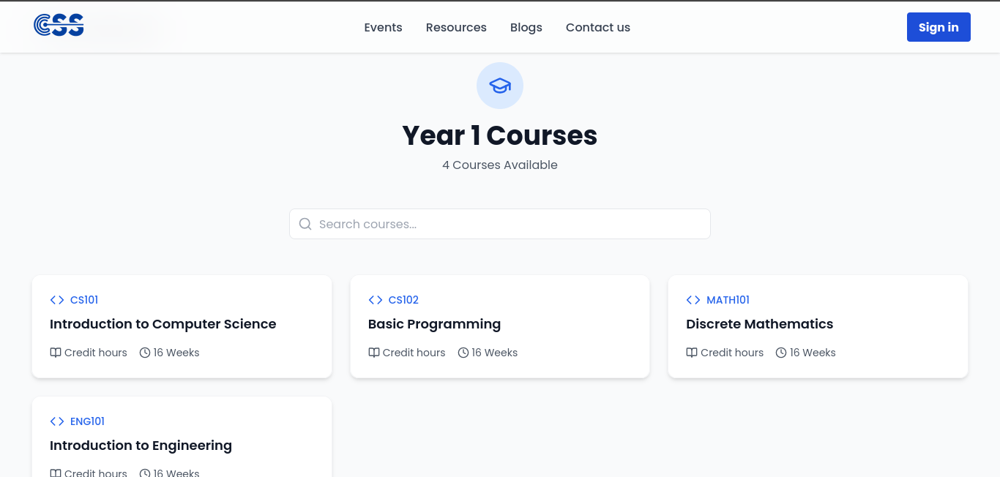

---

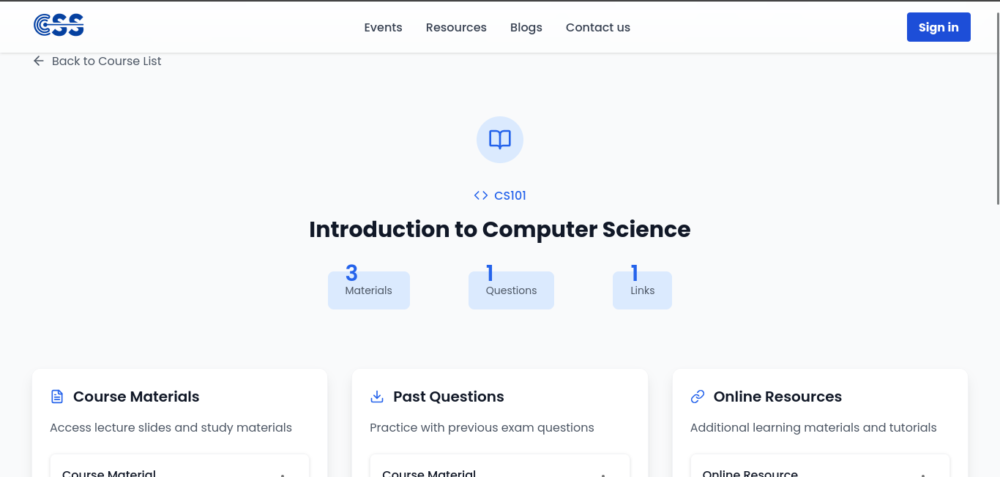

---

## Saving Resources
- User after having account on the platform can save academic resources for later or even download them

---
## User Dashboard
- The Department site comes with a user dashboard for students different from the executive dashboard where students can acess their saved resoursces and slides and also check upcoming exams with maps 
- This Dashboard comes with account settings and saved blogs and an overview and more
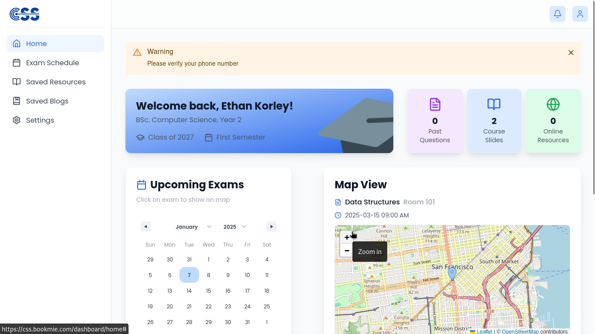
- User also have option to delete account which will delete every data about them including slides etc
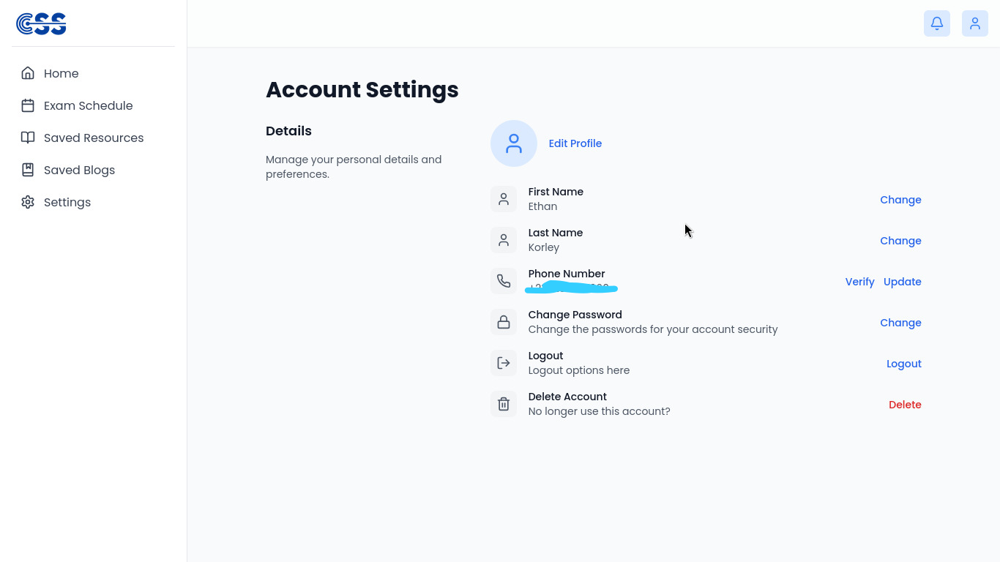

---
### **Note:**

- The President or the Academic Board must approve resources before they are displayed, as only trusted content is shared with students.
---

### Notifications and Communication

- The system comes with feature known as Notify User; this sends out specific messages to students via sms using the Css Knust sms sender id to communicate messages intended for that specific user.
- Sms is used since it is the most reliable and simple way for students to check their messages.
- Instances where this is useful could be sending out sms to a user who lost thier student is (assuming they are registered on the platform) and more ...

The notification can be sent via:

- **SMS** (if configured): A text message containing the basic details of the exam (location, time, and map link).

---

### **Exam Allocation and Management**

The **Exam Allocation Section** is a comprehensive platform built to manage the allocation of examination locations to students. It ensures that students receive timely information about their assigned exam venues, the corresponding exam times, and relevant details such as maps and coordinates. Administrators can efficiently control and manage exam allocations, making the entire process smooth and transparent. The system also ensures that all notifications, including exam details and location data, are automatically sent to students.

- **Exam Location Assignment**: Admin assigns a specific location to each student (e.g., Room 101, Building A).
- **Exam Time**: The admin can set specific exam start and end times for each student.
- **Google Maps Integration**
### Map Section Usage
- Move to the map section to select location of the exam on the map 
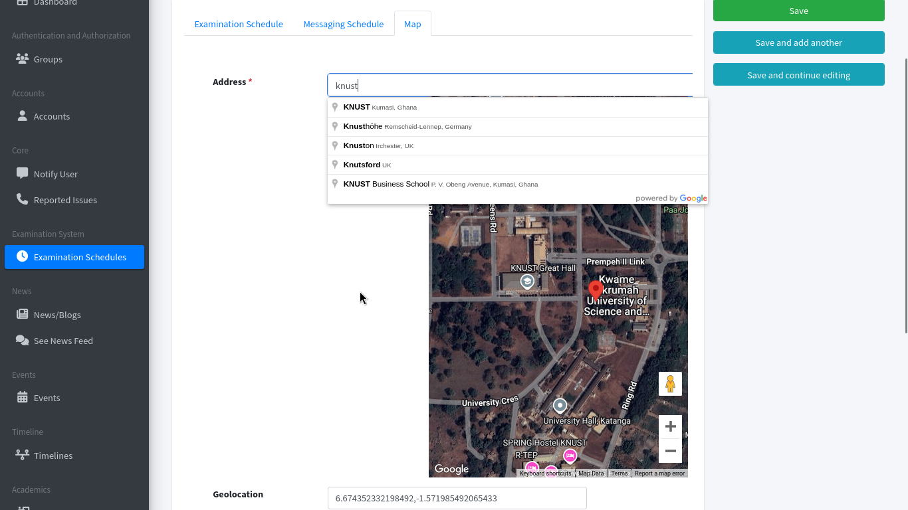

---

- Ones there, search Knust in the search bar provided to situate the map pointer on knust borders so that from there you can drag the pointer to where the collge of the exam is to be written
- For precise allocation of the collge enlarge the map view with the toggle map bar and move the pointer to the location  
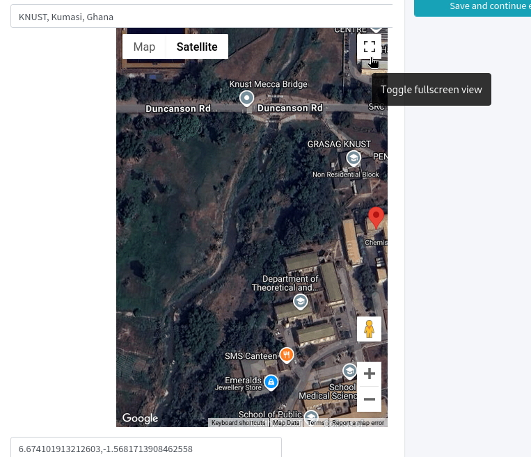

---

- After that the map should look like this.
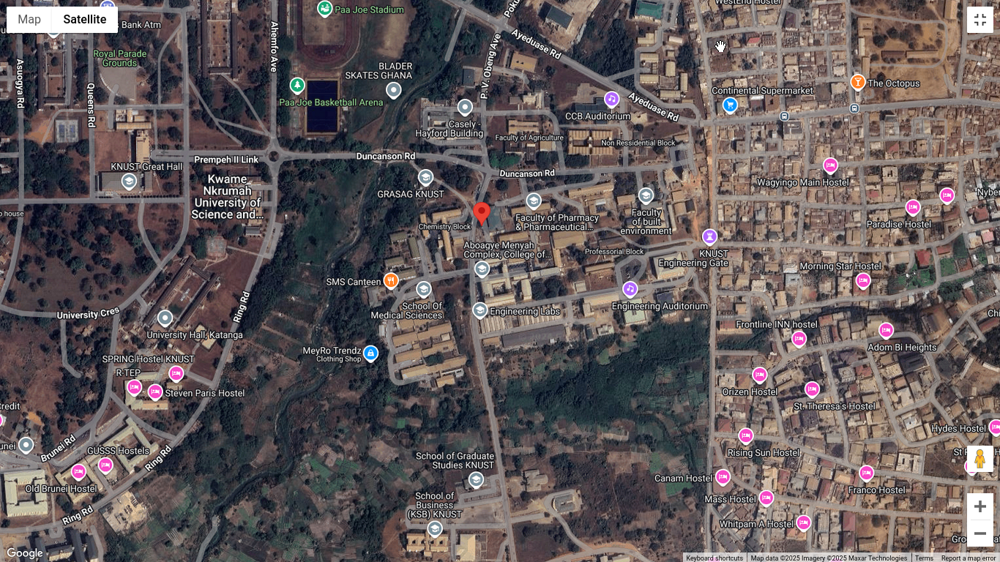

- As you drag the pointer the longitude and latitude of the examination changes in real time and could seen in the geolocation field.
- This will be supply to the frontend to display the location of the exam

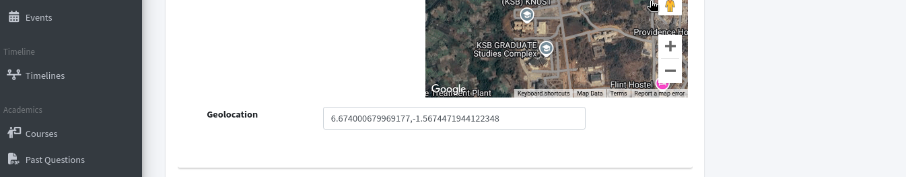

---

### **Note:**

- Only authorized personnel (admin or designated executives) are permitted to modify or update the allocations to avoid errors or conflicts.

---

### **Admin Dashboard and Controls**

The Admin Dashboard is the control center of the Exam Allocation System, providing administrators with an easy-to-use interface to manage all aspects of exam assignments.

- **Examination Overview**: The admin can view all current and upcoming exam allocations for students, including their locations and times.
- **Search and Filter Options**: The dashboard allows the admin to filter students by exam location, status (allocated, pending, etc.), and exam time.
- **Modification and Reallocation**: The admin can reassign students to different locations or update exam times as necessary.
- **Bulk Allocation**: The admin can assign exam locations to multiple students simultaneously (for example, for a particular department or course).

### **Note:**

- All changes made through the admin dashboard are automatically updated in the system and notified to the affected students.

---

### **Examination Notifications and Communication**

The system automatically sends out notifications to students once their exam locations and times are confirmed. The notifications contain all necessary details, such as:

### Note: 
- The Examination allocation system ask for time the examination scheduled message is suppose to be sent ideally an hour before the paper starts. If this is information is not supply the system automatically sends the message 2 hours before the paper 

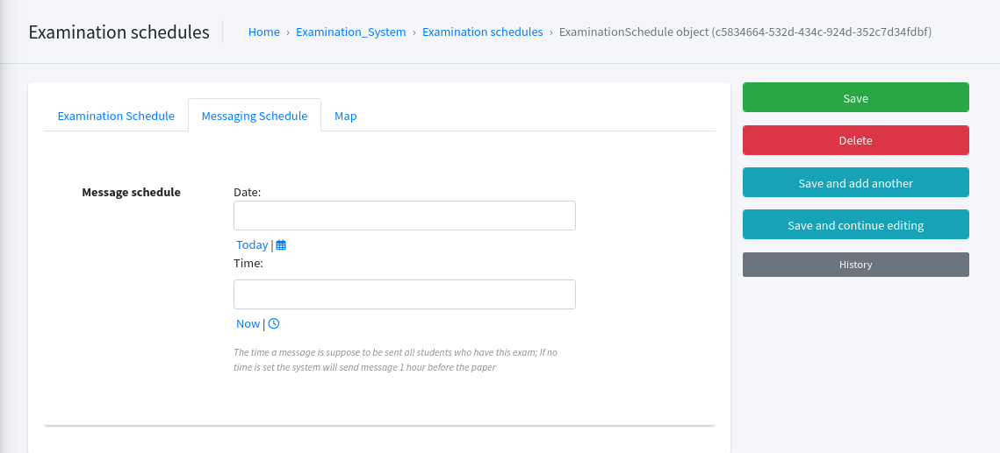

- **Exam Location**: Coordinates of the exam venue and its address.
- **Exam Time**: The scheduled start and end time of the exam.
- **Map Link**: A link to the location on Google Maps, making it easy for students to find their exam venue.

The notification can be sent via sms:
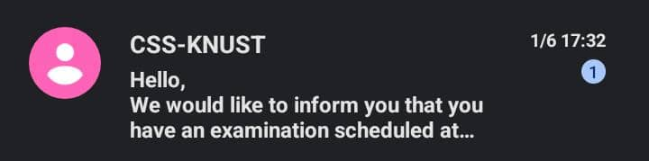

---

- **SMS** : A text message containing the basic details of the exam (location, time, and map link).
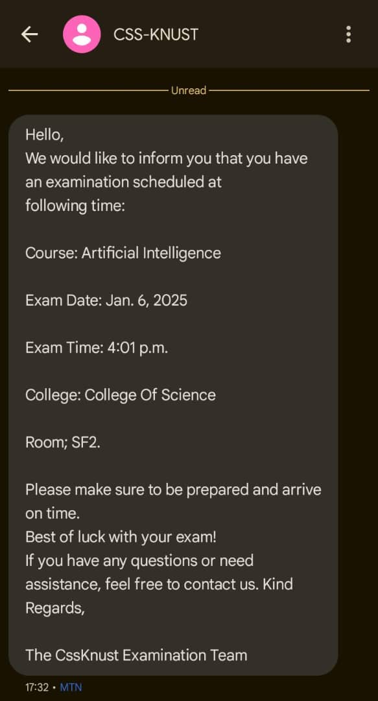

---

### **Note:**

- Students receive a single notification upon allocation, but the admin can manually resend notifications if any updates or changes are made to the exam details using the notify user feature.

---

### **Google Maps Integration**

This section allows students to access the exact location of their exam venue through an integrated Google Maps link.

- The admin inputs the coordinates (latitude and longitude) for each exam location.
- The system generates a Google Maps link that students can click to view the exam venue and plan their route accordingly.

### **Note:**

- Accurate coordinates are critical for proper map functionality. The admin must double-check location data before finalizing allocations.

---

### Products and Merchandise
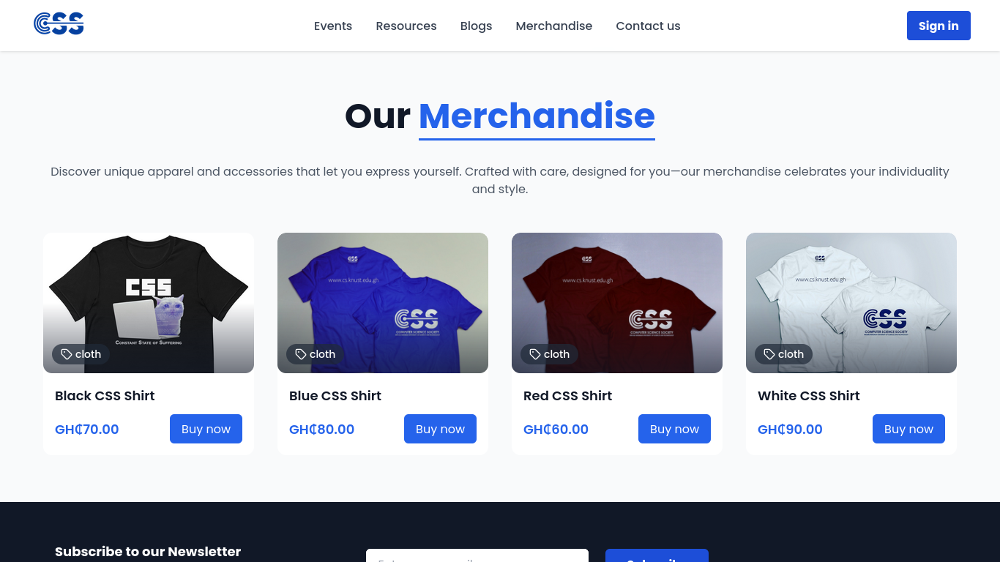
- The product section allow students and other individuals to Purchase the department products and Merchandise
- This section like all the other section is controled by an appointee or excutive with persmission to add products and verify purchases
- The appointee can be prevented from deleting payments History by the persmission section disgust above to make there is curruption

---

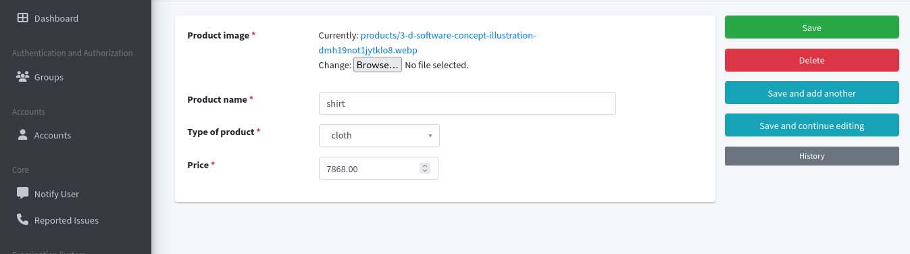
- The Product section uses paystack for payments and a purchase code is sent to the user who made the purchase which he/she will use to verify his purchase later on the system
- The above is to allow anyone to make save purchases without neccessary having an account on the platform

#### Product Verification After payments

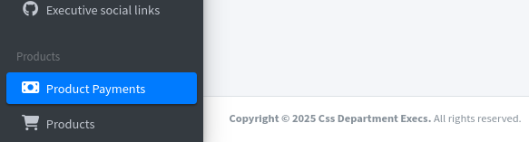

- After payments the user is sent the purchase code on sms 
- He/She alerted to keep the  code secure and not share bacause to present the code to the excutive in charge of payments and product delivery
- The excutive can search for the Purchase code to verify if for sure the payment was made before giving the product to the user
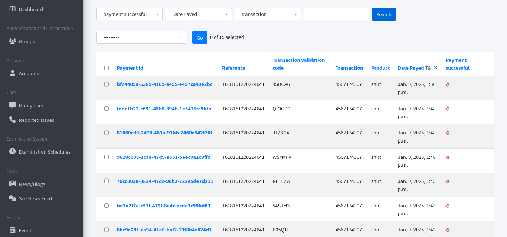

#### Purchase SMS

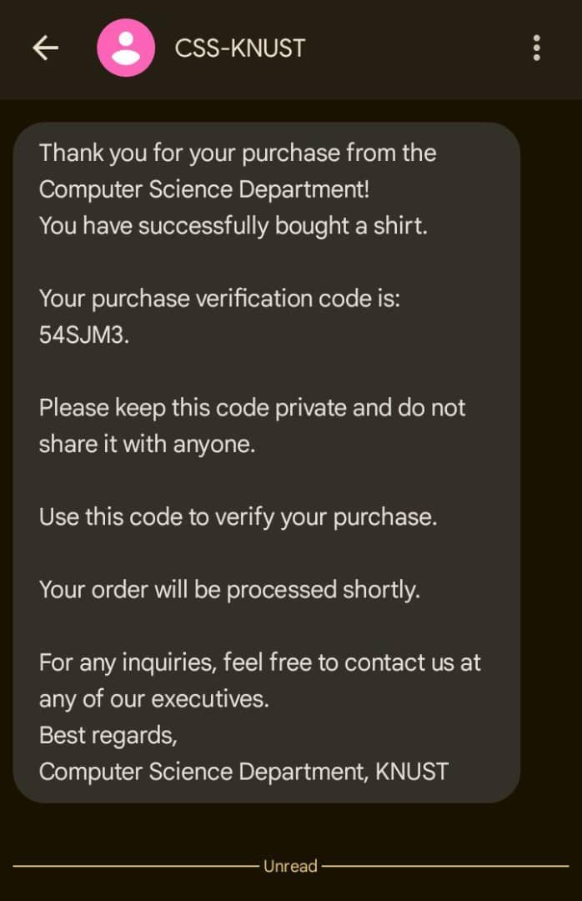

#### Searching Code

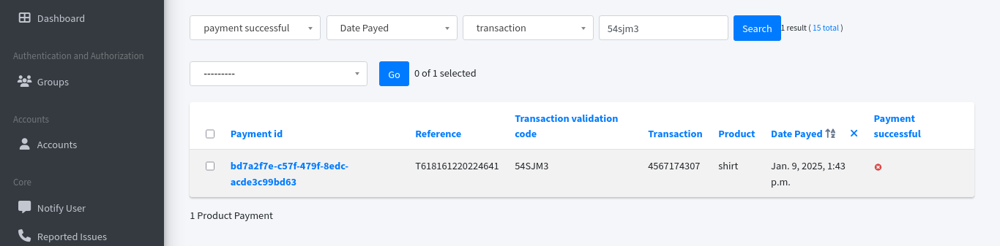

- Purchase codes are unique and can not be deleted after creation to prevent manipulation or payment history 

---

### **System Logs**

The system maintains a detailed log of all activities within the admin dashboard, including:

- **Exam Allocation Changes**: Who made the changes and when.
- **Notifications Sent**: Tracks which students were sent notifications and when.
- **Student Status Updates**: Logs updates to student allocation status (e.g., reallocation, new times).

### **Note:**

- The logs serve as an important audit trail for administrators to track changes and maintain transparency.

---

## Upcoming Events

The Events and Programs section grants permissions to those in charge to write about upcoming events in the department, along with pictures and videos. This allows the department to keep students informed about upcoming activities.

---

## Internships
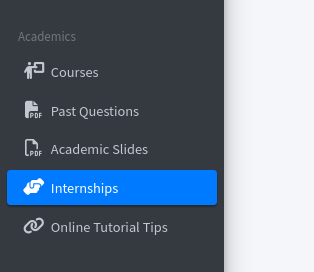
- This section is allows the permited excutive or group of excutives to upload Internships on the platform with the link ot register 

---
## Timeline and Executive Position History (Achievements)

The Timeline is a historical record of events and programs within the department. After each event, pictures and videos are uploaded to the platform with student names tagged. If approved by the President, these are displayed publicly.

The goal of this feature is to preserve memories of department activities. Even years later, students can search for their names and view the events they participated in, along with related photos.

- Pictures can be removed from the timeline through a special request from the user, along with an explanation. If approved, the pictures will be removed.

---

## Executive Positions and Info (github, linkdin, twitter etc)

This information is controlled and provided by the administrators which is managed and changed in every change in executives
Executives account and changed to inactive after thier time in office and new roles are given after the neccessary permissions are assign

---

## News And Blogs

- Similar to events, this section is where news related to the department and blogs about Tech are written on the admin dashboard by individuals who permissions assign to them by the P.R.O Commitee. The news and blogs are published dynamically, so it doesn't need to be hardcoded each time. News and blog updates are automatically displayed for students to read.

## News and Blogs Feed

---

## Advertisements

On the business side, the system allows ads to be displayed in order to generate sponsorship for the department. These ads are controlled by the department and can appear on the news site, event announcements, and other sections once approved.

---

## The Plan

The frontend of the system will be open-source, allowing students to contribute. The backend will be maintained by core students for academic purposes, providing hands-on experience and the opportunity to work on a live project. This initiative aims to boost students' confidence in tackling real-world systems.

---

**Note:** For any questions or further clarification on specific features, please feel free to reach out. Some features are explained in more detail practically.

## ERD
- Png of the ER Daigram for the database
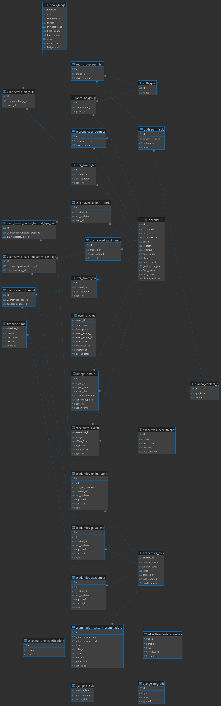

