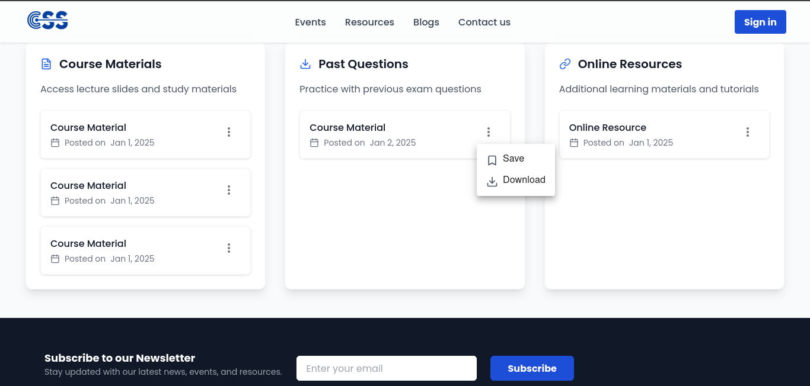

# CSS Administration System

## Sections

The system is divided into the following sections from the admin to the frontend:

- [Accounts and Permissions Management For Executives](#accounts-and-permissions-management)
- [Academics and Resources](#academics-and-resources)
- [Exam Allocation System](#exam-allocation-system)
- [Exam Message Scheduling](#exam-message-scheduling)
- [Exam Map Direction](#exam-map-scheduling)
- [Events and News/Blogs](#events-and-news)
- [Student Specific SMS Notification](#)
- [Internships](#internships)
- [Report/Contact Us Control Service](#contact-us-control-service)
- [Timeline and Executive Position History](#timeline-and-executive-position-history-achievements)
- [Student Dashboard](#user-dashboard)
- [Academic Resources Saving In Account](#)
- [Blog Saving](#)
- [Advertisements](#advertisements)
- [Products and Merchandise Purchase](#products-and-merchandise)
- [And More](#and-more)

---

### Frontend Hosted On [Here](http://css.bookmie.com)  
### Frontend CodeBase [Here](https://github.com/Bookmie-Devs/CSS-KNUST-Frontend)  
### Database ERD Design [Here](#erd)  
### Backend Api Docs [Here](https://cssknust.pythonanywhere.com/api-docs/)  
### Backend FileSystem [Here]()

---

## Overview

The CSS Administration System is a platform designed to manage various roles and responsibilities within the CSS Department. It is organized into sections corresponding to different levels of access, ensuring that proper permissions are granted to each role. The system allows the President, or the Admin (acting as a proxy when the President is unavailable), to manage these permissions and all aspects of the system effectively.

---

## Executives Admin Control System

This section controls the site from news, blogs, events, to educational resources, which are regulated by the right executive in charge. An executive assigned to a group can only view, edit, or create entities that the group has permissions for, based on rules set by the system admin (President or Proxy). 

---

## Department Site

---

---

---

## Accounts and Permissions Management

Each CSS Executive or appointee is provided with an Administrator account by the elected President or Proxy Administrator. During account creation, permissions are set according to the user's role. The account details, such as index number, phone number, and a custom password, are provided, and the user can change their password later.

- The executive dashboard is only available to authorized executives and can be accessed after login on the department site as an option to log into the executive dashboard.

---

---

**Note:** The login page to the executive dashboard can only be seen after the system verifies that you are an active staff member.

#### Recommended View for Executive Dashboard:
Due to the complex structure and different components available on the executive dashboard, it is highly recommended to access it on a laptop for the full view.

---

### Account Activation For Executives:

- Executives without accounts should first sign up as regular students on the frontend and later request access to the executive dashboard. Once the account is in the system, the President or Proxy Administrator can assign the necessary permissions.

### Account Misuse:

- If an account or position is misused, the President can deactivate the account (not delete it). The account can be reactivated after careful consideration.

---

## Managing Executive Groups and Permissions

In the CSS System, **Executive Groups** and **Permissions** are used to control the level of access different users have. This section explains how to manage these groups and permissions for the members of your society.

### Understanding Executive Groups

**Executive Groups** categorize users based on their roles. Each group has different levels of access, which are inherited by the users in that group. Common groups include:

- **Executive Board**: Full control over the system.
- **General Members**: Can view and create content but cannot delete or modify existing content.
- **Visitors**: Can only view content.

### Managing Executive Groups

1. Navigate to the **Groups** section.
2. To create a new group, click **Add Group**, name the group (e.g., "Event Coordinators"), and click **Save**.
3. To edit a group, select the group, modify its members and permissions, then click **Save**.

---

### Managing Permissions for Executive Groups

Permissions define the actions users within a group can perform, such as:

- **View content**: Ability to see specific pages.
- **Add content**: Ability to create new records.
- **Edit content**: Modify existing content.
- **Delete content**: Remove data.

---

### Assigning Users to Executive Groups

1. Go to the **Users** section.
2. Select the user and assign the appropriate group (e.g., **Executive Board**).
3. Click **Save**.

---

### Best Practices for Managing Executive Groups and Permissions

- Use clear and straightforward group names.
- Limit high-level permissions to users who truly need them.
- Regularly review and update groups and permissions.

---

## Academics and Resources

This section allows the President or the executive in charge of academics to create courses and add resources that students need. Resources can include YouTube videos, articles, and files (e.g., slides, PDFs).

- Courses are created before academic resources are assigned to them.
- Resources include videos, files, articles, etc.
- Once approved, resources are made available on the frontend for students.

---

## Saving Resources

Users can save academic resources for later or download them for offline use.

---

## User Dashboard

The user dashboard allows students to access their saved resources, slides, and exam allocation maps. It also includes account settings, saved blogs, and more.

**Note:** Users can also delete their accounts, which removes all data associated with them.

---

### Internships

This section contains internship opportunities provided by the internship committee. Executives can add internships with links to apply.

---

## Notifications and Communication

The **Notify User** feature sends specific messages to students via SMS using the CSS KNUST SMS sender ID. SMS is used because it is the most reliable communication method.

Notifications can include:

- Exam locations and schedules.
- Important department updates.
- Specific student notifications (e.g., lost ID).

---

## Exam Allocation and Management

This section manages the allocation of exam locations to students, providing them with the necessary details about their exam venue, time, and map directions.

- Admins assign exam locations and times.
- Google Maps integration allows accurate location allocation.

---

### Exam Map Section Usage

To assign exam locations:

1. Move to the map section.
2. Search for KNUST in the search bar to situate the pointer within the campus.
3. Drag the pointer to the correct location.

---

### Admin Dashboard and Controls

The admin dashboard is the control center for managing exam locations, student allocations, and all notifications.

- **Examination Overview**: View all current and upcoming exam allocations.
- **Search Options**: Filter students by exam location, status, and time.
- **Bulk Allocation**: Assign exam locations to multiple students simultaneously.

---

### Exam Messaging

The system schedules messages to remind students of exam details, sent via SMS.

---

### Products and Merchandise

The product section allows students and individuals to purchase department products and merchandise.

- Managed by an appointed executive with permissions to add products and verify purchases.

---

## Contact Us Control Service

The "Contact Us" system allows users to submit complaints, which are stored and handled by the appropriate executives for feedback and action.

---

## Advertisements

The system allows advertisements to be displayed to generate sponsorship for the department. Advertisements can appear on news sites, events, and other sections after approval.

---

## The Plan

The frontend of the system is open-source, allowing students to contribute. The backend will be maintained by core students for academic purposes, providing hands-on experience and the opportunity to work on a live project.

---

## License

The CSS Administration System is licensed under the [MIT License](LICENSE), allowing for free use, modification, and distribution with proper credit.

---

## Acknowledgements

We would like to thank all the developers, designers, and contributors who made this system possible.

---

## Conclusion

The CSS Administration System is a comprehensive platform that helps manage academic resources, student notifications, exams, events, and executive group permissions. By centralizing all administrative tasks in one platform, it enables efficient management of the CSS department at KNUST. Whether you're an admin, executive, or student, this system is designed to meet your needs with ease and reliability.

Thank you for using the CSS Administration System!

---

## Database and ERD

The database system used is SQLite, with the production database protected on the server. 

